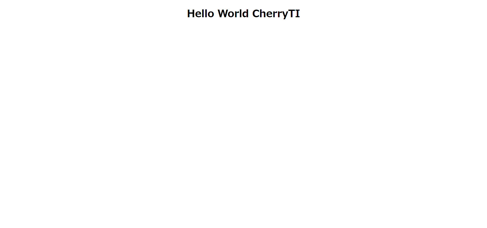

# CherryTI

## Image


## Overview
Homebrew framework using PHP

## Requirement
- PHP
- MySQL

## How to install
git

```shell
git clone https://github.com/fumiya5863/CherryTI.git
```

composer

```shell
composer create-project fumiya5863/cherry-ti
or
composer create-project fumiya5863/cherry-ti --prefer-dist
```

## How to use

When downloaded with Compoer or github, the folder name is different. I will fix it, so please wait for a while

```shell
cd CherryTI
or
cd cherry-ti

cd env
cp .env.sample .env
```

## Usage
Why don't you play with the lightweight framework and play around with it?

The reason why I made this framework this time is that I want more people to develop the framework. The reason is that by creating a framework from scratch, you have a much better understanding of the framework you have been using. I think that it is rare to know the contents during development. So why don't you take this opportunity to use the framework?
The name is Cherry TI.

If you have any concerns, please raise an issue. Also, please do more and more pull requests. I'm so happy that I'm very welcome.

## Folder structure
```
- app/
  - controller/
  - model/
  - routes/
  - view/
  - .htaccess
- env/
  - .env.sample
  - .htaccess
- storage/
  - log/
  - .htaccess
- system/
  - bootstrap/
  - class/
  - constant/
  - template/
  - .htaccess
- .htaccess
- composer.json
- index.php
```

## Author
[fumiya5863](https://github.com/fumiya5863)

## License
The source code is licensed MIT.
